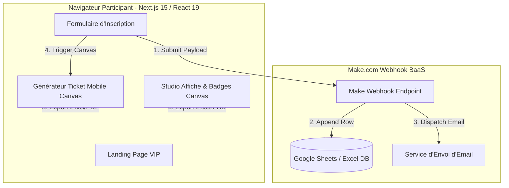

# 🏛️ ARCHITECTE.md — Blueprint d'Architecture Système & Agents

## 📐 1. Diagramme d'Architecture Globale (Mermaid)

---

## 🤖 2. Architecture Multi-Agents (Chefskrsidoine7)

- **Agent Orchestrateur** : `Chefskrsidoine7` (Gestion de projet, supervision, mémoire et radiographie d'impact).
- **Sous-Agents Spécialisés** :
  - `ui-ux-designer` : Conception visuelle VIP & tokens de couleur.
  - `codebase-pattern-finder` : Respect des motifs TypeScript strict & OWASP.
  - `mermaid-diagram-specialist` : Génération des diagrammes d'architecture.
  - `communication-excellence-coach` : Écriture des textes engageants et bienveillants.
  - `general-purpose` & `ascii-ui-mockup-generator` : Tâches complémentaires.
