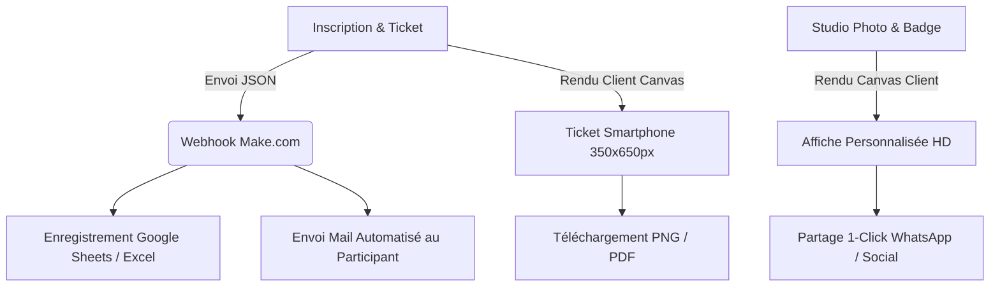

# 📄 PRD.md — Product Requirements Document (La Bible Fonctionnelle)

## 📌 1. Vue d'Ensemble du Produit

**Nom du Projet** : Brunch Light of the World — 2ᵉ Édition  
**Thème Central** : *<< LA GUÉRISON DES VICTIMES DE VIOLS >>*  
**Date & Heure** : 14 Août 2026 à 08h30 GMT  
**Lieu** : HETEC Dokui, Abidjan, Côte d'Ivoire  
**Slogan / Philosophie** : *"Parce que la guérison est possible et que chaque vie a de la valeur, nous vous invitons à venir vivre un moment d'écoute, de partage, de restauration et d'espérance dans un cadre bienveillant."*

---

## 🎨 2. Identité Visuelle & Dress Code

- **Couleur Domiante** : Blanc Pur (`#FFFFFF`) pour apporter pureté, sérénité et espérance.
- **Accents Principaux** : 
  - Violet Royal (`#6A00C8` / `#31005C`) — Symbole de la femme, de la dignité et de la guérison.
  - Jaune Solaire (`#FCE100`) — Symbole de l'homme, de la lumière et de l'énergie.
  - Sombre Neutre (`#111111`) — Pour la lisibilité et l'élégance typographique.
- **Code Vestimentaire (Dress Code)** :
  - **Femme 👩🏻** : Violet 💜 (`#6A00C8`)
  - **Garçon 👨🏻** : Jaune 💛 (`#FCE100`)

---

## 🎯 3. Objectifs du Produit & Parcours Utilisateur (User Flow)

### 3.1 Objectifs Clés
1. **Sensibilisation et Restauration** : Offrir une vitrine digitale élégante, rassurante et professionnelle pour promouvoir l'événement.
2. **Billetterie Digitale Instantanée (Format Smartphone)** : Offrir à chaque participant un ticket personnalisé au format vertical mobile (350x650px) avec QR Code, téléchargeable immédiatement et envoyé par email via Make.com Webhook.
3. **Engagement Communautaire & Viralité (Studio d'Affiches)** : Permettre aux participants de charger leur photo et de générer une affiche de soutien personnalisée (avec badges : Invité, Serviteur, Média, Organisation, etc.) partageable directement sur WhatsApp, Facebook, Instagram et LinkedIn.
4. **Acquisition de Communauté** : Rediriger les participants vers le groupe WhatsApp officiel de l'événement (`0576341955`).

---

## 🔬 4. Radiographie d'Impact (Impact Mapping)

### Analyse des Risques & Mitigations :
- **Risque d'échec réseau Make.com** : Le ticket est généré immédiatement côté client dans le navigateur, garantissant que l'utilisateur l'obtient même en cas d'interruption temporaire d'internet.
- **Incompatibilité affichage mobile** : Conception Mobile-First avec CSS responsive et Canvas adaptable à toutes les résolutions d'écran.

---

## 📋 5. Spécifications des Fonctionnalités (MVP)

| ID | Fonctionnalité | Description | Priorité |
| :--- | :--- | :--- | :--- |
| **FT-01** | Landing Page VIP | Design épuré, héro section, animations scroll, carrousel d'affiches infini | P0 (Indispensable) |
| **FT-02** | Programme Interactif | Accordéon/cartes dynamiques style Aspex Africa (8h30 à la clôture) | P0 (Indispensable) |
| **FT-03** | Générateur de Ticket Mobile | Ticket vertical 350x650px + QR Code + Téléchargement PNG/PDF | P0 (Indispensable) |
| **FT-04** | Intégration Webhook Make | POST direct vers `https://hook.eu2.make.com/u3bh8d1dirnkj93ciix96co74k24nb4k` | P0 (Indispensable) |
| **FT-05** | Studio Affiche & Badges | Import photo + choix badge (Serviteur, Invité, Média...) + export HD | P0 (Indispensable) |
| **FT-06** | Intégration Communautaire | Modal redirection WhatsApp (0576341955) & réseaux sociaux | P0 (Indispensable) |
| **FT-07** | Carte & Guide HETEC Dokui | Localisation interactive avec détails d'accès | P1 (Secondaire) |

---

## 🛡️ 6. Stratégie Soft Delete & Intégrité

Conformément aux règles du projet (`GEMINI.md`), toutes les entités gérées en mémoire ou schémas de données intègrent un attribut `deleted_at: string | null` pour garantir la réversibilité et l'auditabilité des données sans suppression physique irréversible.
